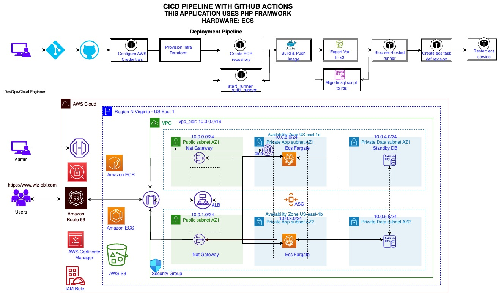

# Deploy Pipeline

## Overview

This GitHub Actions workflow automates the deployment pipeline for an application. It utilizes Terraform for infrastructure provisioning, AWS services for deployment, and Flyway for database migration. The workflow is triggered on each push to the `main` branch.

## Environment Variables

The following environment variables are required for the workflow:

- `AWS_ACCESS_KEY_ID`
- `AWS_SECRET_ACCESS_KEY`
- `AWS_REGION`
- `TERRAFORM_VERSION`
- `TERRAFORM_ACTION`
- `PERSONAL_ACCESS_TOKEN`
- `GITHUB_USERNAME`
- `REPOSITORY_NAME`
- `WEB_FILE_ZIP`
- `WEB_FILE_UNZIP`
- `RDS_DB_NAME`
- `RDS_DB_USERNAME`
- `RDS_DB_PASSWORD`
- `ECR_REGISTRY`
- `FLYWAY_VERSION`

## Jobs

### 1. Configure AWS Credentials

Configures AWS credentials for subsequent steps.

### 2. Deploy AWS Infrastructure

Provisions AWS infrastructure using Terraform. Dynamically extracts outputs for use in later steps when the Terraform action is `apply`.

#### Outputs

- `terraform_action`
- `image_name`
- `domain_name`
- `rds_endpoint`
- `image_tag`
- `private_data_subnet_az1_id`
- `runner_security_group_id`
- `task_definition_name`
- `ecs_cluster_name`
- `ecs_service_name`
- `environment_file_name`
- `env_file_bucket_name`

### 3. Create ECR Repository

Creates an ECR repository for Docker images.

### 4. Start Self-hosted EC2 Runner

Starts a self-hosted EC2 runner for GitHub Actions.

#### Outputs

- `label`
- `ec2-instance-id`

### 5. Build and Push Docker Image to ECR

Builds a Docker image and pushes it to the ECR repository.

### 6. Create Environment File and Export to S3

Creates an environment file with necessary variables and uploads it to an S3 bucket.

### 7. Migrate Data into RDS Database with Flyway

Uses Flyway to migrate data into the RDS database.

### 8. Stop Self-hosted EC2 Runner

Stops the self-hosted EC2 runner when the deployment is complete.

### 9. Create New Task Definition Revision

Creates a new revision of the ECS task definition.

#### Outputs

- `new_td_revision`

### 10. Restart ECS Fargate Service

Restarts the ECS Fargate service with the updated task definition.
